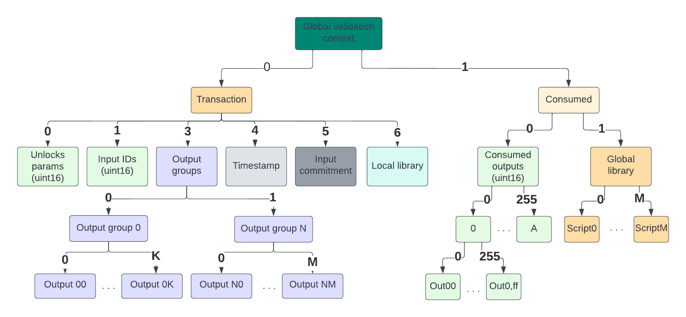

# Easy ledger

`long index` is 2 **big-endian** bytes of `uint16` 

## Output

Output is `lazytree.Tree`. Each element at the level 0 is some data which may or may not be interpreted as **constraint invocation**.
Output can be:
* `transaction output`. 
The invocation `path` has prefix [0,3]. The invocation `path` has form [0,3, group, idx, <block nr>]. <block nr> = 0 for the `main invocation`   
* `consumed outputs`
The invocation `path` has prefix [1,0]. The invocation `path` has form [1,0, <2 bytes long index>, <block nr>]. <block nr> = 0 for the `main invocation`

**Constraint invocation** has generic structure:
* `invocation target` (IT) - 1 byte
  * IT == 0 it is `inline invocation`
    * the next up to 254 bytes are the invoked script. The `invocation data` is considered `nil` for inline invocation 
  * IT == 1 it is local library invocation
    * the next 1 byte is local library index (the hash checking must be in another constraint)
    * the next up to 253 bytes is `invocation data`
  * if IT = 2-255 it is global library invocation with the script index IT 
    * The next up to 254 bytes is `invocation data`

The element at index `0` is **main invocation.** 

The validation process calls:
* all main invocations of the _transaction outputs_ in the lexicographical order of the (output group, index)
* all main invocations of the _consumed outputs_ in the order of the long index (which is equal to the lexicographical order of its big-endian form) 

